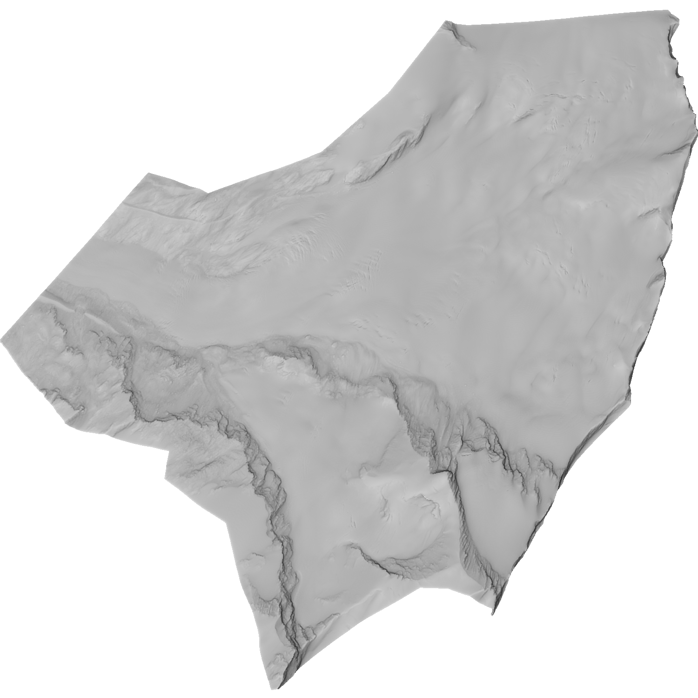

# The Findelengletscher Dataset



[Original Dataset Website](https://doi.pangaea.de/10.1594/PANGAEA.887718) | [Additional Dataset Details](https://hpicgs.github.io/multi-temporal-point-cloud-datasets-survey/details/Findelengletscher)

## Notes

## Scripts
* `create_pointclouds.py` creates point clouds from the DSMs
* `compute_statistics.py` computes the minimum, median, and maximum of the number of points and average point neighbor distance across all epochs

The expected folder structure for the data is as follows:

```
Findelengletscher
  |-- raw
        |-- 2005_October_1m
            |-- 2005_October_1m.tif
        |-- 2009_October_1m
            |-- 2009_October_1m.tif
        |-- ...
  |-- pointclouds            # this gets created by the create_pointclouds.py script
        |-- 2005_October_1m.laz
        |-- 2009_October_1m.laz
        |-- 2010_April_1m.laz
        |-- 2010_September_1m.laz
```