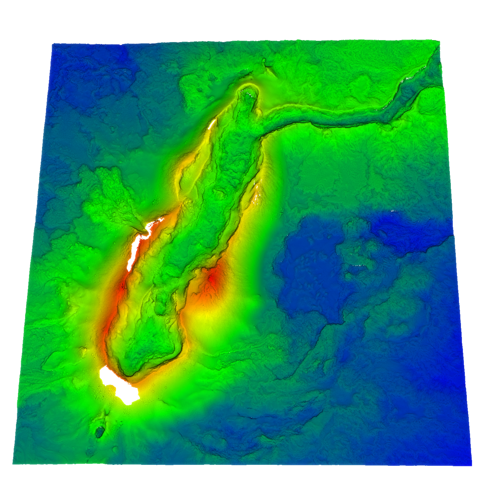

# The Holuhraun Dataset



[Original Dataset Website](https://arizona.figshare.com/articles/dataset/Repeat_surveys_of_the_topography_of_the_main_vent_of_the_2014_2015_eruption_at_Holuhraun_Iceland_Merged_LiDAR_and_UAS_point_clouds_from_2015_2016_2018_and_2019/19680372) | [Additional Dataset Details](https://hpicgs.github.io/multi-temporal-point-cloud-datasets-survey/details/Holuhraun)

## Notes
  - While the first epoch was only acquired via TLS, for the subsequent epochs, also photogrammetry on aerial images was used, resulting in denser point clouds that cover a larger area.

## Scripts
* `compute_statistics.py` computes the minimum, median, and maximum of the number of points and average point neighbor distance across all epochs

The expected folder structure for the data is as follows:

```
Holuhraun
  |-- 2015_Baugur_UTM28N_WGS84_TLS.las
  |-- 2016_Baugur_UTM28N_WGS84_TLS_UAV_merge.las
  |-- ...
```