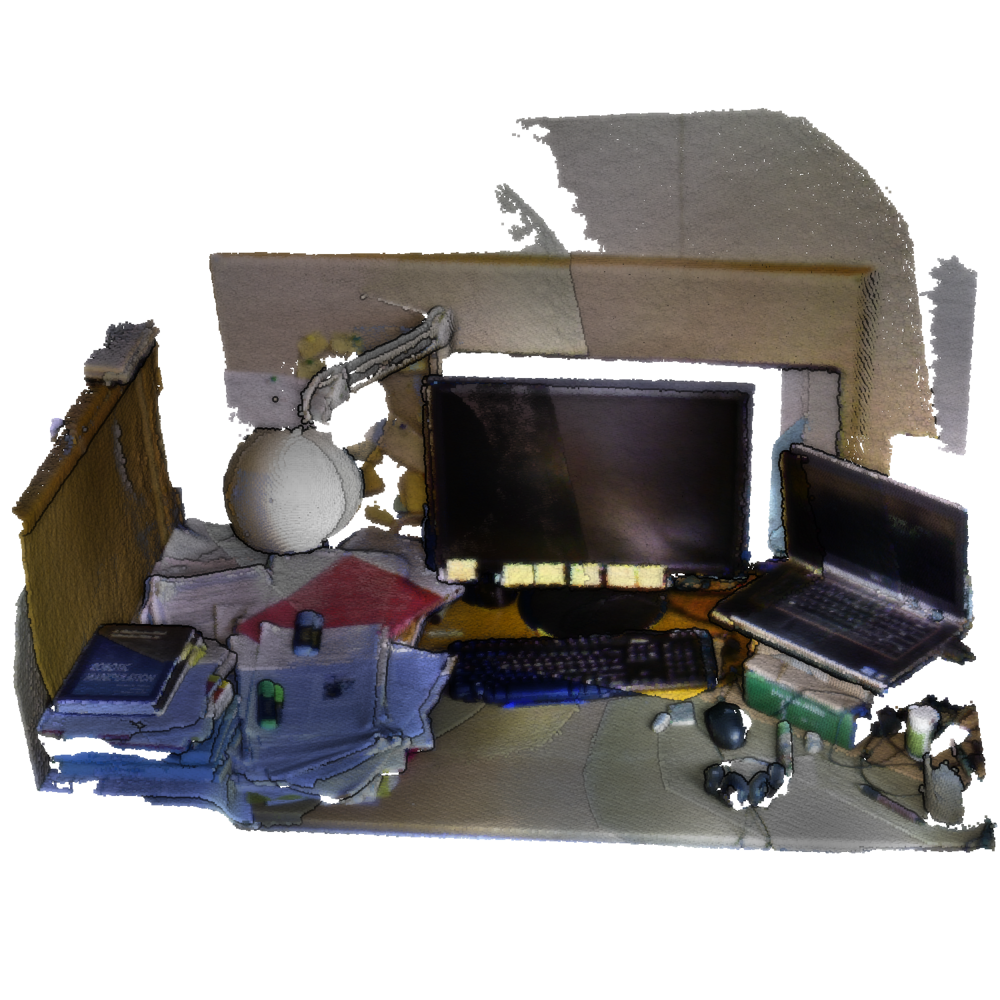

# The KTH-3D-TOTAL Dataset



[Original Dataset Website](https://strands.pdc.kth.se/public/kth-3d-total/readme.html) | [Additional Dataset Details](https://hpicgs.github.io/multi-temporal-point-cloud-datasets-survey/details/KTH-3D-TOTAL)

## Notes  
  - The point clouds are available as text files and PCD files.
  - The full archive download link is not working anymore
  - A downsampled version and a cropped version is available for each scan. In the latter case, everything except the tabletop has been removed and the scene has been aligned with the coordinate axes
  - Most scans are well registered, some only coarsely, and some few not at all.
  - Semantic/instance labels are available in the form of XML files for the cropped point clouds. The folder for the labels in JSON format is empty.
  - In contrast to all other file names, the file `Carl_Table_131116_Aft-seg.pcd` contains a hyphen instead of an underscore.
  - We compute the statistics on the cropped scans, as these are the ones that are annotated and actually used by the authors. Change labels could be derived from per-instance position/orientation. 


## Scripts
* `download_pointclouds.py` downloads the annotated point cloud files and the XML label files from the dataset. Additional files could be downloaded by extending the `download_paths.csv` that has to be passed as the first argument to the script. Note: upon downloading `Carl_Table_131116_Aft-seg.pcd`, the hyphen gets replaced by an underscore.
* `compute_statistics.py` computes the minimum, median, and maximum of the number of points and average point neighbor distance across all epochs. Also computes the share of partial epochs.
* `compute_avg_change_points.py` computes the average percentage of points that are labeled as changed across all second epoch point clouds. For this, we use the provided XML label files to extract the poses and number of points for the given objects at each epoch. If the pose difference for the same object in two subsequent epochs is above a significance threshold, we assume this object to have changed and count its points as change points. Also appeared and removed objects are considered during the computation.

The expected folder structure for the data is as follows. It gets automatically created by the `download_pointclouds.py` script. Note that we use an additional folder level (one folder for each individual tabletop), compared to the original folder structure of the dataset.

```
KTH-3D-TOTAL
  |-- pcd-annotated
      |-- Akshaya_Table
          |-- Akshaya_Table_131023_Aft_seg.pcd
          |-- Akshaya_Table_131023_Eve_seg.pcd
          |-- ...
      |-- Ali_Table
      |-- Carl_Table
      |-- ...
  |-- xml-annotated
      |-- Akshaya_Table
          |-- Akshaya_Table_131023_Aft_seg.xml
          |-- Akshaya_Table_131023_Eve_seg.xml
          |-- ...
      |-- Ali_Table
      |-- Carl_Table
      |-- ...
  |...
```