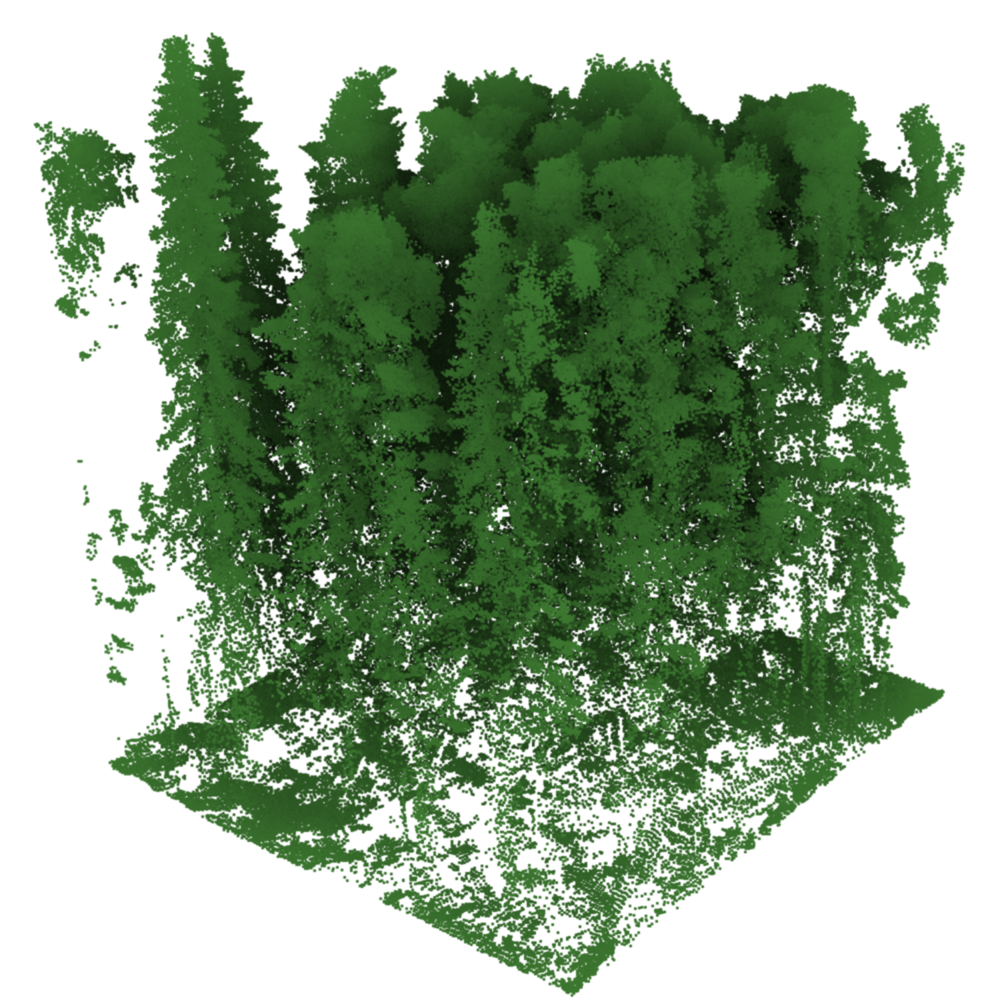

# The Kalkkinen Dataset



[Original Dataset Website](https://etsin.fairdata.fi/dataset/3cd9e715-03bb-40da-a082-eb8a356de795) | [Additional Dataset Details](https://hpicgs.github.io/multi-temporal-point-cloud-datasets-survey/details/Kalkkinen)

## Notes
  - While the point clouds are georeferenced, the epochs are not aligned horizontally. If all plots are rendered together, they are evenly spaced with the later epochs being on a common (higher) plane above the earlier epoch point clouds. Maybe this offset has been explicitly added, e.g., for visualization purposes.


## Scripts
* `compute_statistics.py` computes the minimum, median, and maximum of the number of points and average point neighbor distance across all epochs

The expected folder structure for the data is as follows:

```
Kalkkinen
  |-- kalkkinen2000pc
      |-- toposys1.txt
      |-- toposys2.txt
      |-- ...
  |-- kalkkinen2021pc
      |-- minivux1.txt
      |-- minivux2.txt
      |-- ...
```