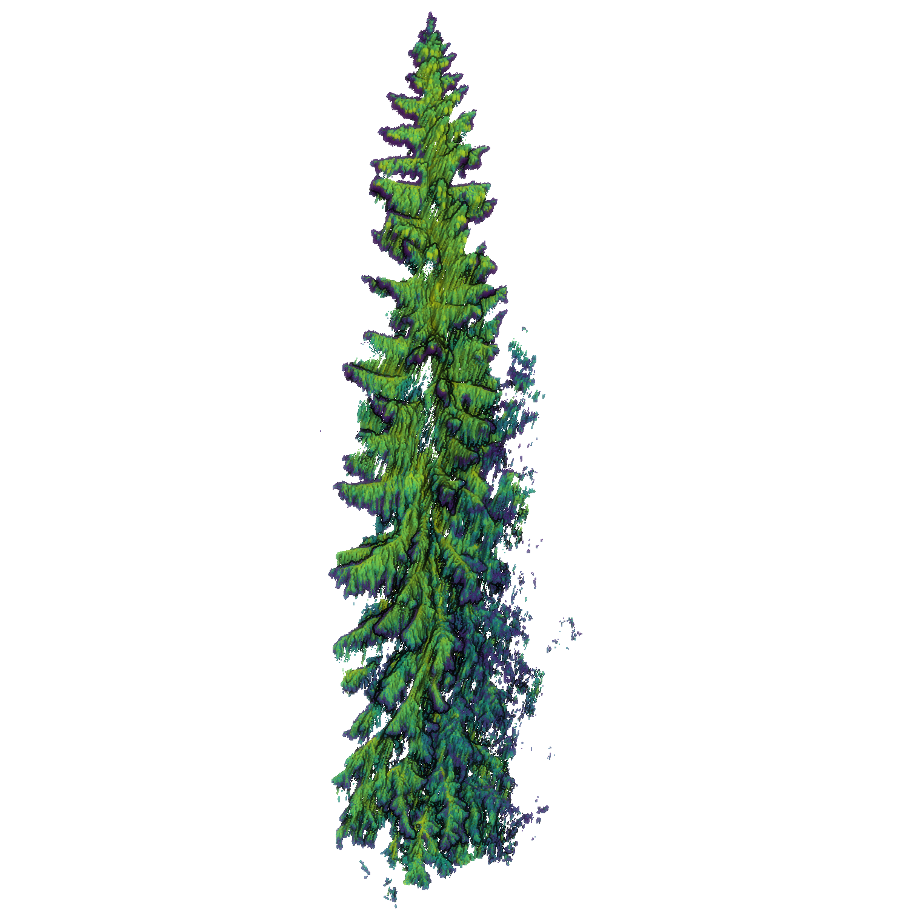

# The LiPheStream Dataset



[Original Dataset Website](https://etsin.fairdata.fi/dataset/b60c308a-b619-40b9-a98e-f7cba5cc906c) | [Additional Dataset Details](https://hpicgs.github.io/multi-temporal-point-cloud-datasets-survey/details/LiPheStream)

## Notes
  - The point clouds are sorted according to their tree species. Since the point clouds are georeferenced, the individual tree point clouds could be merged into a larger point cloud with semantic/instance information derived from the folder structure and point cloud IDs.
  - The individual trees were automatically segmented from a full-area scan. The segmentation is erroneous in some cases.
  - The trees are divided into different scan quality categories. It is not entirely clear what quality in this context means and how it is determined. It seems to have something to do with the segmentation results.
  - File `210216_180502_12456_1_2.laz` is erroneous and can't be read.


## Scripts
* `compute_statistics.py` computes the minimum, median, and maximum of the number of points and average point neighbor distance across all epochs. Also computes the share of partial epochs. Before the computations take place, the ZIP archives are extracted into correspondingly named folders and subsequently removed. The required disk space for the dataset does not change, as the archive compression is neglegible.

The expected folder structure for the data is as follows:

```
LiPheStream
  |-- LiPheStream
      |-- norway_spruce
          |-- quality_0        # when executing the compute_statistics.py script, the archives get extracted
              |-- 10560.zip       
              |-- 10576.zip
              |-- 13686.zip
              |-- ...
          |-- quality_1
          |-- quality_2
          |-- quality_3
          |-- quality_4
      |-- scots_pine
      |-- silver_birch
      |-- unidentified
  |-- LiPheStream_Winter
      |-- norway_spruce
      |-- scots_pine
      |-- silver_birch
      |-- unidentified
  |-- ...
```