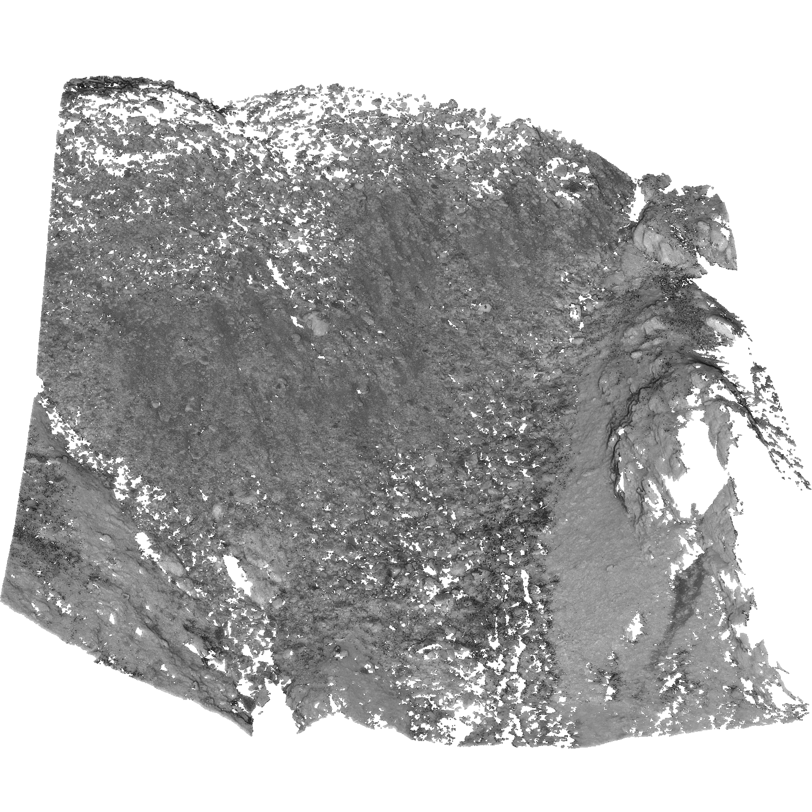

# The M3C2-EP Dataset



[Original Dataset Website](https://doi.org/10.11588/data/XHYB10) | [Additional Dataset Details](https://hpicgs.github.io/multi-temporal-point-cloud-datasets-survey/details/M3C2-EP)

## Notes
  - The tile 652600_5189000 is only available for epoch 2018b. The tile 652600_5189100 is only available for the epochs 2018a and 2018b.

## Scripts
* `compute_statistics.py` computes the minimum, median, and maximum of the number of points and average point neighbor distance across all epochs

The expected folder structure for the data is as follows:

```
M3C2-EP
  |-- 2017
        |-- 2017_652700_5189000_gnd.laz
        |-- 2017_652700_5189100_gnd.laz
        |-- ...
  |-- 2018a
        |-- 2018A_652600_5189000_gnd.laz
        |-- 2018A_652600_5189100_gnd.laz
        |-- ...
  |-- 2018b
        |-- 2018B_652600_5189100_gnd.laz
        |-- 2018B_652700_5189000_gnd.laz
        |-- ...
  |-- ...
```