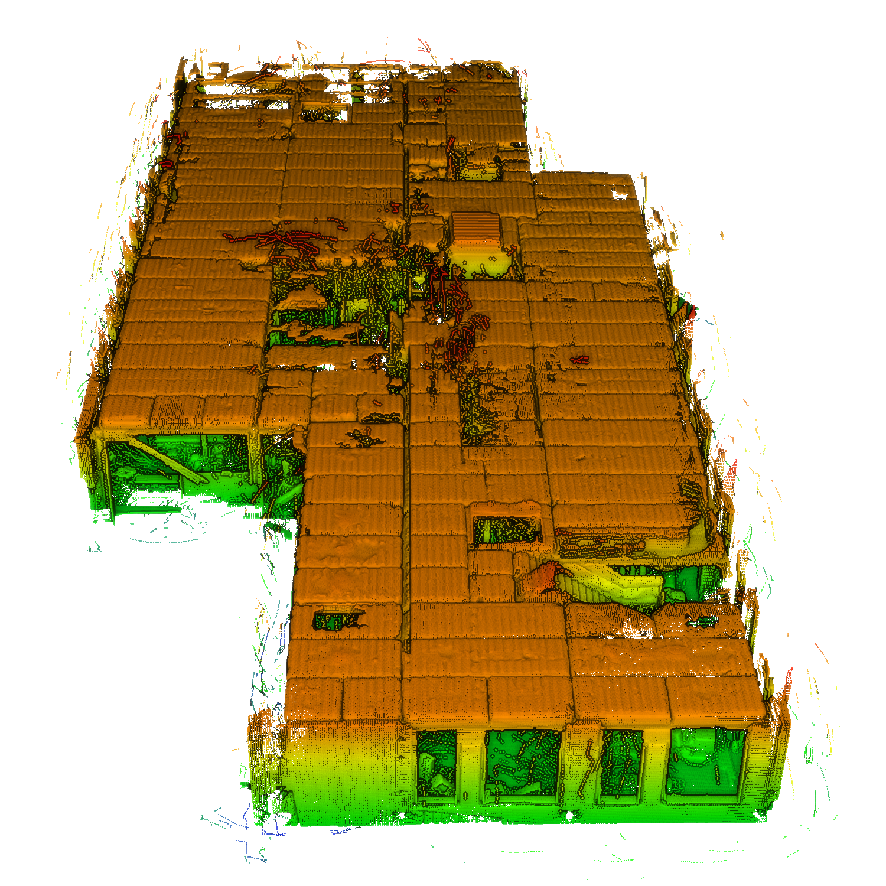

# The Nothing Stands Still (NSS) 2025 Dataset



[Original Dataset Website](https://www.nothing-stands-still.com/challenge) | [Additional Dataset Details](https://hpicgs.github.io/multi-temporal-point-cloud-datasets-survey/details/NSS)


## Notes
- For the test split, no ground truth poses are provided

## Scripts
* `create_pointclouds.py` aligns the point cloud fragments of the train and val split into the global coordinate system using the given poses.
* `compute_statistics.py` computes the minimum, median, and maximum of the number of points and average point neighbor distance across all epochs, as well as the share of partial epochs.

The expected folder structure for the data is as follows:

```
NSS
  |-- raw
      |-- point_cloud
          |-- Bldg1_Stage1_Spot0.ply
          |-- Bldg1_Stage1_Spot1.ply
          |-- Bldg1_Stage1_Spot2.ply
          |-- ...
      |-- pose_graph
          |-- test
              |-- Bldg4_Graph1.json
              |-- Bldg4_Graph2.json
              |-- Bldg4_Graph3.json
              |-- ...
          |-- train
          |-- val
      |-- ...
  |-- pointclouds        # This gets created by the create_pointclouds.py script
      |-- Bldg1
          |-- Stage_1.laz
          |-- Stage_2.laz
          |-- ...
      |-- Bldg2
      |-- ...
```