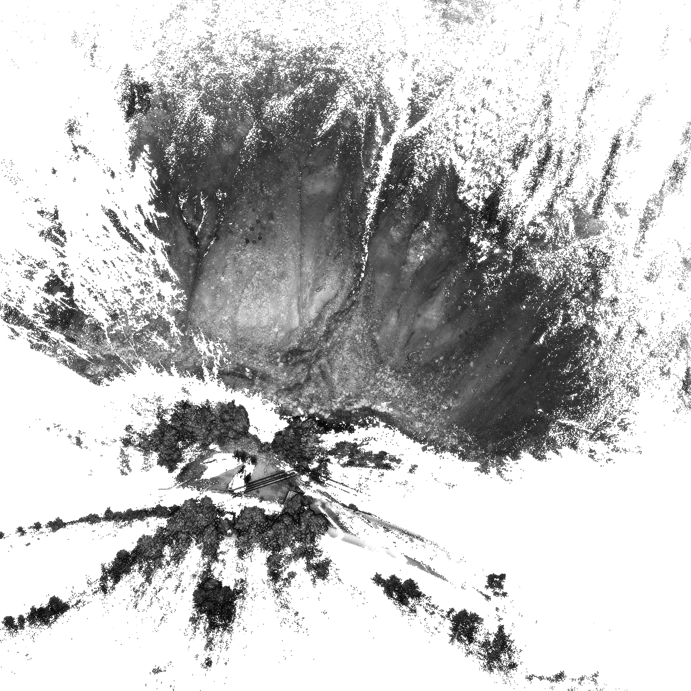

# The Nesslrinna Dataset



[Original Dataset Website](https://doi.pangaea.de/10.1594/PANGAEA.901293) | [Additional Dataset Details](https://hpicgs.github.io/multi-temporal-point-cloud-datasets-survey/details/Nesslrinna)

## Notes
  - The 2019 epoch is only available in a proprietary format from RIEGL. We excluded it from our computations.

## Scripts
* `compute_statistics.py` computes the minimum, median, and maximum of the number of points and average point neighbor distance across all epochs

The expected folder structure for the data is as follows:

```
Nesslrinna
  |-- 20150714_Nesslrinna_landslide_UTM32N.txt
  |-- 20170719_Nesslrinna_landlside_UTM32N.txt   # the file name has a typo
  |-- ...
```