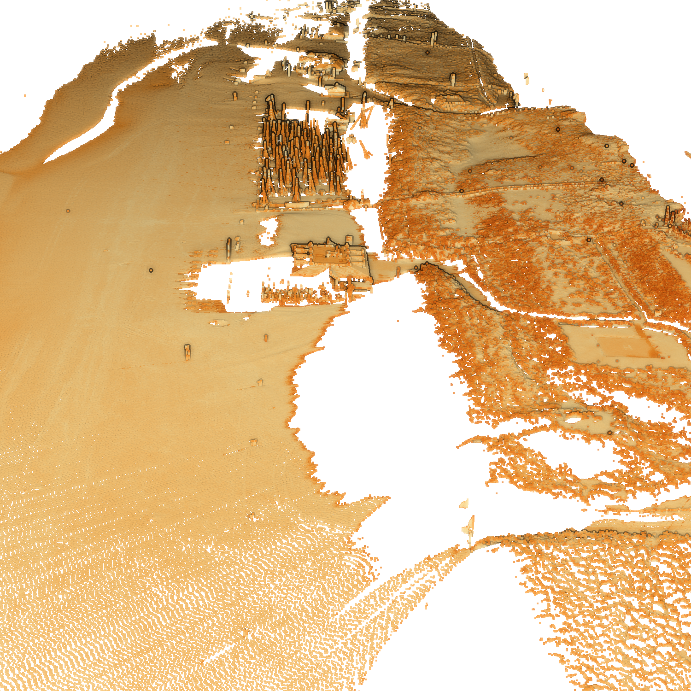

# The Noordwijk Dataset



[Original Dataset Website](https://data.4tu.nl/datasets/1aac46fb-7900-4d4c-a099-d2ce354811d2/2) | [Additional Dataset Details](https://hpicgs.github.io/multi-temporal-point-cloud-datasets-survey/details/Noordwijk)

## Notes
  - Some scans only contain very few points, sometimes due to weather impairment, at other times due to the tide. There are 4 scans with 10, 1, 1, and 0 points respectively.

## Scripts
* `compute_statistics.py` computes the minimum, median, and maximum of the number of points and average point neighbor distance across all epochs

The expected folder structure for the data is as follows:

```
Noordwijk
  |-- scans
        |-- 190711
            |-- 190711_135655.laz
            |-- 190711_145654.laz
            |-- ...
        |-- 190712
        |-- 190713
        |-- ...
```