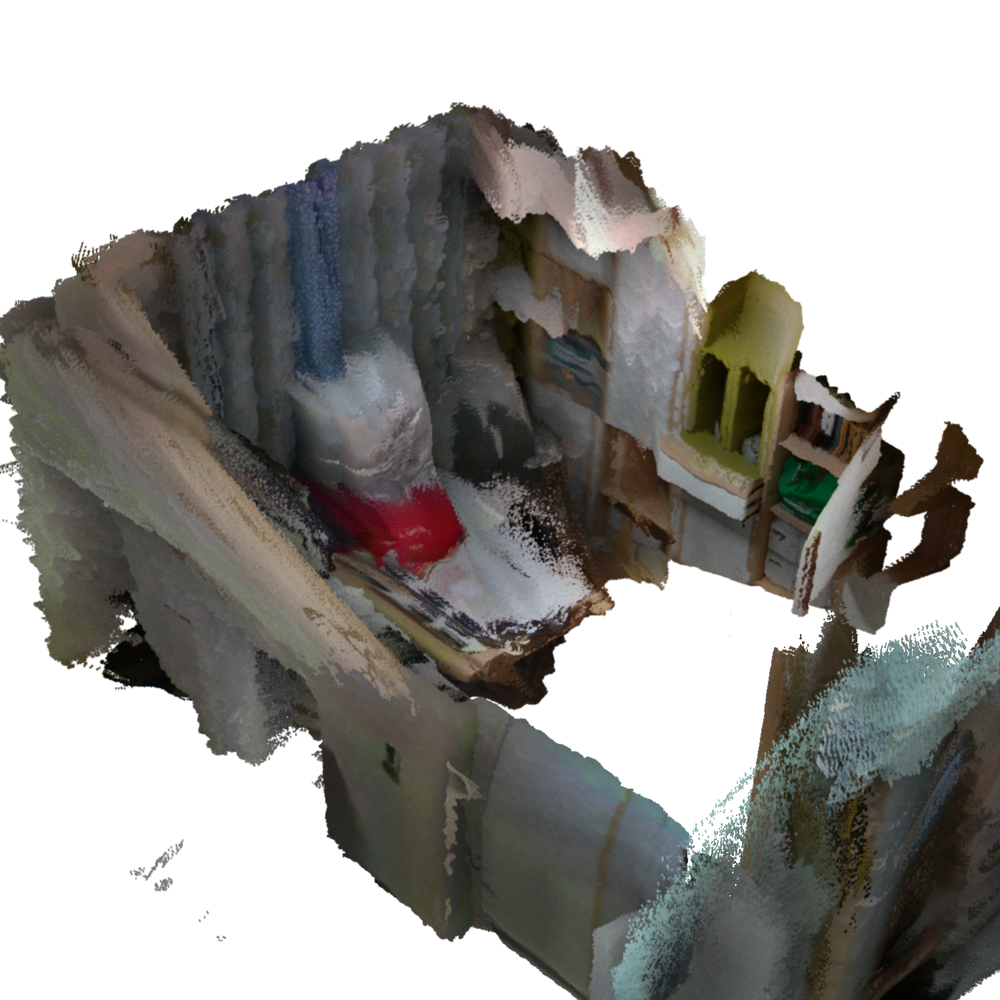

# The OpenLORIS-Scene Dataset



[Original Dataset Website](https://lifelong-robotic-vision.github.io/dataset/scene) | [Additional Dataset Details](https://hpicgs.github.io/multi-temporal-point-cloud-datasets-survey/details/OpenLORIS-Scene)

## Notes
  - The depth images are quite noisy and the ground truth poses are not perfect (as also mentioned in a Github issue and the paper itself).
  - Some scenes have only little overlap between the epochs (e.g., the office scene)


## Scripts
* `create_pointclouds.py` uses the depth and color images together with the given poses and intrinsics to create pointclouds via backprojection. The results are of rather low quality and could probably be improved by using more advanced depth filtering and integration approaches.
* `compute_statistics.py` computes the minimum, median, and maximum of the number of points and average point neighbor distance across all epochs.
* `create_2d_renderings.py` renders the point clouds resulting from the `create_pointclouds.py` script to the ground plane. As each tile is rendered separately, the color mapping is only valid within a tile, leading to visible tile borders. However, in our case, we used these renderings only for assessing the area coverage of a pointcloud.

The expected folder structure for the data is as follows:

```
OpenLORIS-Scene
  |-- raw
        |-- cafe
            |-- cafe1-1
                |-- aligned_depth
                    |-- 1560004885.446165.png
                    |-- 1560004885.479522.png
                    |-- ...
                |-- color
                    |-- 1560004885.446172.png
                    |-- 1560004885.479529.png
                    |-- ...
                |-- aligned_depth.txt
                |-- color.txt
                |-- sensors.yaml
                |-- trans_matrix.yaml
                |-- ...
            |-- cafe1-2
        |-- corridor
        |-- home
        |-- market
        |-- office
  |-- pointclouds           # This gets created by the "create_pointclouds.py" script.
        |-- cafe
            |-- cafe1-1
                |-- tile_0_0.laz
                |-- tile_0_1.laz
                |-- tile_0_2.laz
                |-- ...
            |-- cafe1-2
        |-- corridor
        |-- ...
```