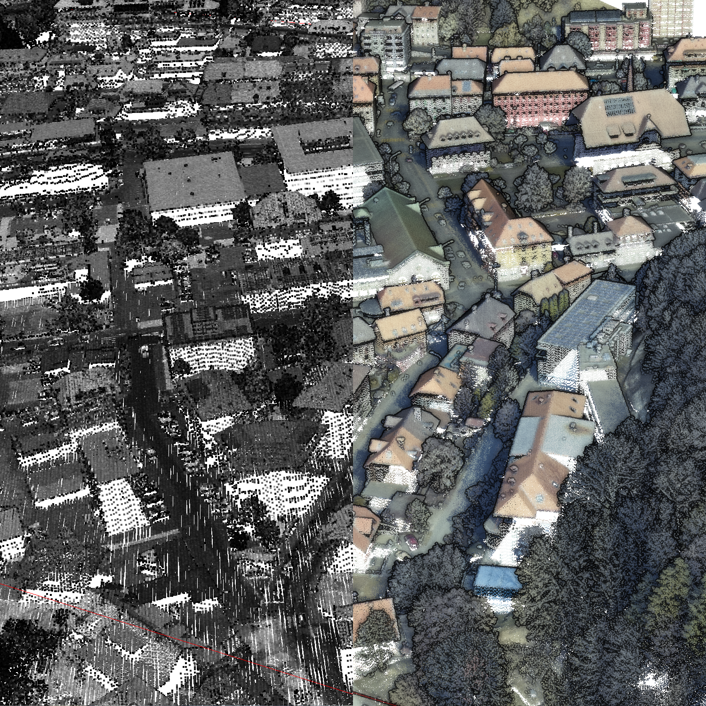

# The QALIDAR Dataset



[Original Dataset Website](https://github.com/swiss-territorial-data-lab/proj-qalidar) | [Additional Dataset Details](https://hpicgs.github.io/multi-temporal-point-cloud-datasets-survey/details/QALIDAR)

## Notes
  - The first epoch exhibits semantic labels for 4 different classes, the second epoch for 19 different classes.
  - Both epochs are named exactly the same, only the file extension differs. The first epoch is stored as LAS file and the second one as LAZ file.

## Scripts
* `compute_statistics.py` computes the minimum, median, and maximum of the number of points and average point neighbor distance across all epochs

The expected folder structure for the data is as follows:

```
QALIDAR
  |-- 2547000_1211500.las
  |-- 2547000_1211500.laz
```