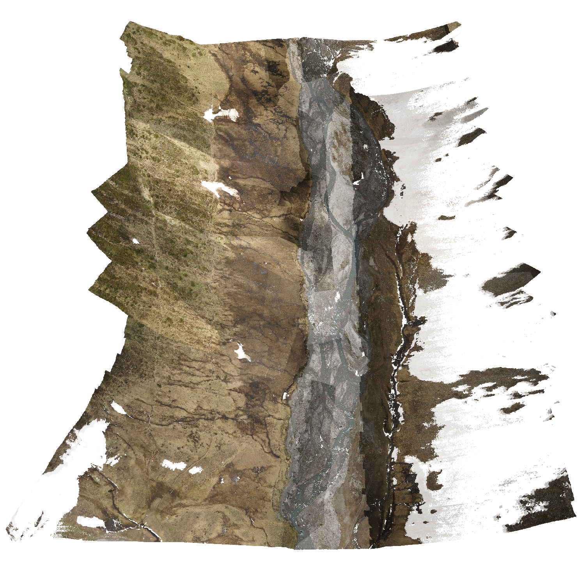

# The Rotmoos Dataset



[Original Dataset Website](https://doi.pangaea.de/10.1594/PANGAEA.898939) | [Additional Dataset Details](https://hpicgs.github.io/multi-temporal-point-cloud-datasets-survey/details/Rotmoos)

## Notes
  - For 2017, only images and ground control points are available but no reconstructed point cloud
  - The 201906_Rotmoos_TPHG is not georeferenced and seems to depict another location than the remaining scans
  - 20190618_rotmoos_rockfall_THPG depicts another location compared to the other scans (but also in the Rotmoos valley)
  - The spatial coverage of the epochs is quite different, which makes it hard to determine the share of partial epochs. If we take the first 2022 scan as reference, 3 of 5 remaining scans have only partial coverage


## Scripts
* `compute_statistics.py` computes the minimum, median, and maximum of the number of points and average point neighbor distance across all epochs


The expected folder structure for the data is as follows:

```
Rotmoos
  |-- 2015_river_erosion_photogrammetry
       |-- 2015_UAV_fixedwing_pointcloud.txt
       |-- ...
  |-- 2021_Rotmoostal_colorized_ULS.laz
  |-- 201906_Rotmoostal_ULS.laz
  |-- 20150709_Rotmoos_glaciers_TLS_UTM32N.txt
  |-- 2022_rotmoos_ULS
       |-- 2022_Rotmoostal_flight1_colorized_ULS.laz
       |-- 2022_Rotmoostal_flight2_colorized_ULS.laz
       |-- ...
```