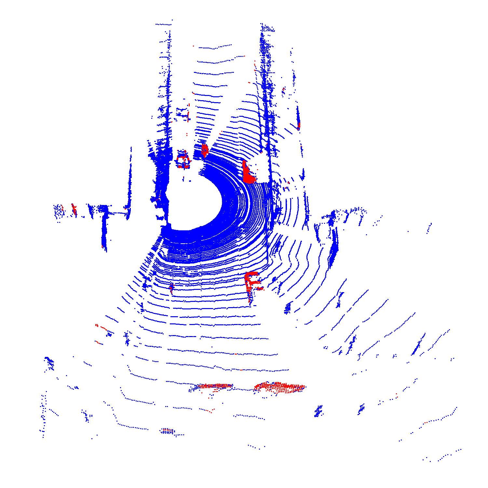

# The SZATKI-Change3D Dataset



[Original Dataset Website](http://mplab.sztaki.hu/geocomp/Change3D.html) | [Additional Dataset Details](https://hpicgs.github.io/multi-temporal-point-cloud-datasets-survey/details/SZTAKI-Change3D)

## Notes
  - Point clouds are captured from locations where a continously scanning vehicle was motionless for some time (traffic lights, parking, etc.). From these locations, pairs of point clouds were selected between which changes occured. In addition to these dynamic changes (pedestrians, vehicles), changes were synthesized by adding/removing street furniture, as well as random deletion of point cloud segments.
  - The change is stored as two-channel binary mask, i.e., each point in epoch 1 and 2 receives a binary change label with respect to the other epoch. The image lattice is used for storing both channels in the same pixel, even though they might not represent the same point due to the coarse registration. A point is marked as changed if its surface patch is not present in the other epoch.
  - The point clouds are purposefully not well registered. A small random offset and rotation was applied to each second epoch point cloud.
  - Change labels are automatically generated and appear to be not very precise.
  - It is not clearly specified which of the two binary channels corresponds to which image.
  - It is unclear, how to revert the range image to a point cloud, given that the point clouds are cropped at 5m vertical height before being mapped to the range image. We used the scanning angles from the HDL64-E scanner for reconstruction, as this specific scanner model was used for a later dataset from the same lab, possibly using similar acquisition hardware. However, the resulting point clouds are still slightly bent.
  - The values in the label image are scaled to 60K with uneven stepsizes between the labels (18K = 1, 36K = 2, 60K = 3). This is probably due to the fact that the labels are stored together with the range images in a 16-bit format.


## Scripts
* `create_pointclouds.py` extracts pointclouds from the range images.
* `compute_statistics.py` computes the minimum, median, and maximum of the number of points and average point neighbor distance across all epochs. Also computes the number of partial epochs and the average percentage of points that are labeled as changed in the second epoch.

The expected folder structure for the dataset is as follows:

```
SZTAKI-Change3D
  |-- raw
      |-- 00001.png
      |-- 00002.png
      |-- 00003.png
      |-- ...
  |-- pointclouds                 # this gets created by the create_pointclouds.py script
      |-- 00001
          |-- epoch0.laz
          |-- epoch1.laz
      |-- 00002
      |-- 00003
      |-- ...
```