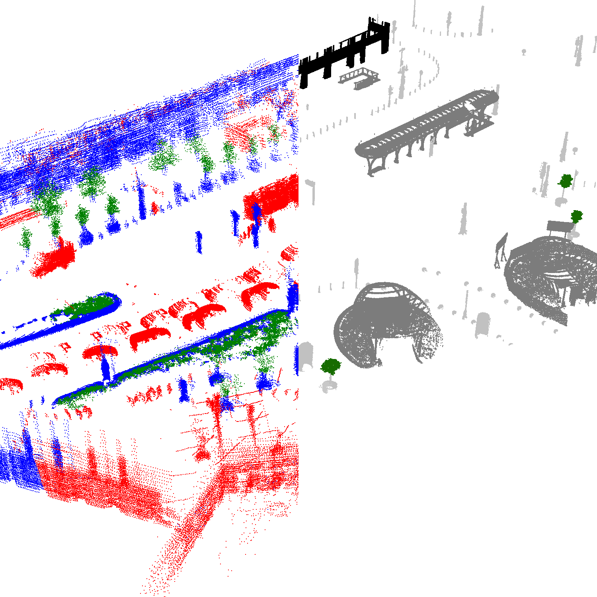

# The SZATKI-CityCDLoc Dataset



[Original Dataset Website](https://github.com/sztaki-geocomp/Lidar-SCU) | [Additional Dataset Details](https://hpicgs.github.io/multi-temporal-point-cloud-datasets-survey/details/SZTAKI-CityCDLoc)

## Notes
  - The second epoch is split into multiple frames, from which some are available as sparser, but annotated variants (change labels + registration information). We only use the annotated data (all frames fused into one point cloud) for computing the metrics.
  - Semantic labels are only available for the first epoch


## Scripts
* `create_pointclouds.py` converts the raw data of the second epochs to unified point clouds.
* `compute_statistics.py` computes the minimum, median, and maximum of the number of points and average point neighbor distance across all epochs. Also computes the average percentage of points that are labeled as changed in the second epoch.

The expected folder structure for the dataset is as follows:

```
SZTAKI-CityCDLoc
  |-- Scenario1 (Fïvám)
      |-- GT change detection
          |-- fovam_8464_636529930750737025.pcd
          |-- fovam_8473_636529930756831427.pcd
          |-- fovam_8482_636529930762769567.pcd
          |-- ...
      |-- GT registration
          |-- fovam_8464_636529930750737025.txt
          |-- fovam_8473_636529930756831427.txt
          |-- fovam_8482_636529930762769567.txt
          |-- ...
      |-- lidar frames
          |-- fovam_8401_636529930708701301.pcd
          |-- fovam_8402_636529930709326378.pcd
          |-- fovam_8403_636529930709951439.pcd
          |-- ...
      |-- fovam_GPS.csv
      |-- fovam_MLS.pcd      # this is the first epoch
      |-- epoch_2.laz        # this gets created by the create_pointclouds.py script
  |-- Scenario2 (Kálvin)
  |-- Scenario3 (Deák)
```