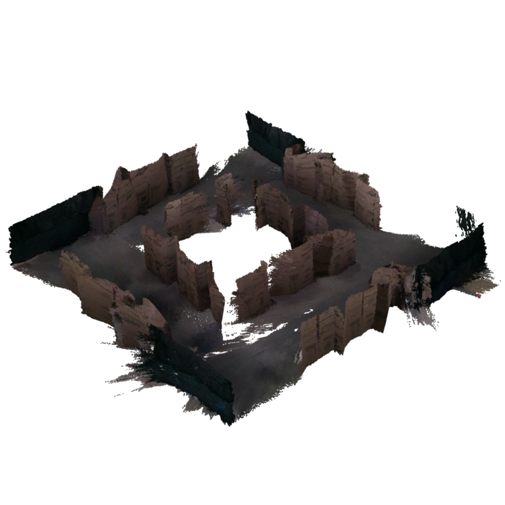

# The TorWIC-Mapping Dataset



[Original Dataset Website](https://github.com/Viky397/TorWICDataset) | [Additional Dataset Details](https://hpicgs.github.io/multi-temporal-point-cloud-datasets-survey/details/TorWIC-Mapping)

## Notes
  - The different epochs have no chronological order, but are grouped according to the type of changes. 
  - Different epochs can be stitched together to create different, changing environments. 
  - The changes are not annotated in the point cloud, but exist in the form of maps per epoch. 
  - The semantic labels are predicted from the RGB frame and are, therefore, not perfect.
  - The "Calibration" folder, which should contain the camera intrinsics, is empty. However, in `utils/calibration.py` of the accompanying source code, the intrinsics appear to be hardcoded.
  - The depth images are quite noisy for farther away surfaces. When thresholding the depth values, the point cloud reconstructions are of significant better quality.
  - For the segmentation images of Scenario_1-1, the file names have six digits instead of four (as is the case for all other epochs)


## Scripts
* `create_pointclouds.py` uses the depth and color images together with the given poses to create pointclouds via backprojection. The results could probably be improved by using more advanced depth filtering and integration approaches.
* `compute_statistics.py` computes the minimum, median, and maximum of the number of points and average point neighbor distance across all epochs.

The expected folder structure for the data is as follows:

```
TorWIC-Mapping
  |-- raw
      |-- Baseline
          |-- Baseline
              |-- Depth
                  |-- 0000.png
                  |-- 0001.png
                  |-- ...
              |-- RGB
                  |-- 0000.png
                  |-- 0001.png
                  |-- ...
              |-- Segmentation
                  |-- 0000.png
                  |-- 0001.png
                  |-- ...
              |-- poses.txt
              |-- ...
      |-- Scenario_1
          |-- Scenario_1-1
              |-- Depth
              |-- RGB
              |-- poses.txt
              |-- ...
          |-- Scenario_1-2
          |-- Scenario_1-3
          |-- ...
      |-- Scenario_2
      |-- Scenario_3
      |-- Scenario_4
  |-- pointclouds           # This gets created by the "create_pointclouds.py" script.
      |-- Baseline
          |-- Baseline
              |-- tile_0_0.laz
              |-- tile_0_1.laz
              |-- ...
      |-- Scenario_1
          |-- Scenario_1-1
              |-- tile_0_0.laz
              |-- tile_0_1.laz
              |-- ...
          |-- Scenario_1-2
          |-- ...
      |-- Scenario_2
      |-- Scenario_3
      |-- Scenario_4
```