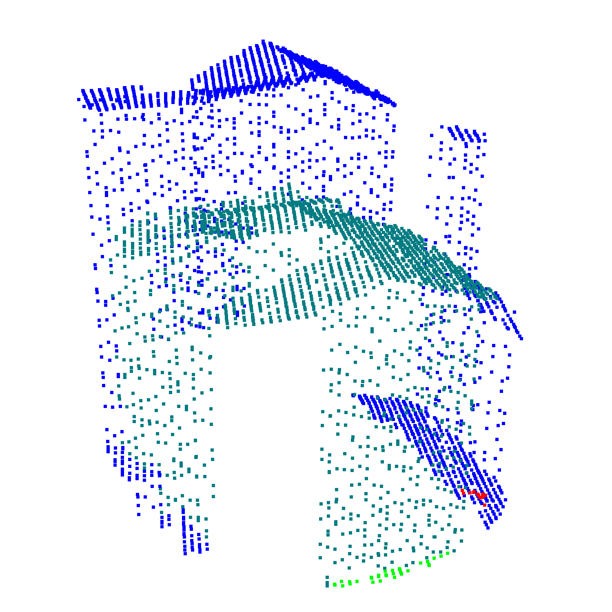

# The Urb3DCD-cls Dataset



[Original Dataset Website](https://ieee-dataport.org/open-access/urb3dcd-urban-point-clouds-simulated-dataset-3d-change-detection) | [Additional Dataset Details](https://hpicgs.github.io/multi-temporal-point-cloud-datasets-survey/details/Urb3DCD-cls)

## Notes
  - In addition to per-point change labels, the majority change per point cloud is specified through the folder structure.
  - Some point clouds contain very few points (even only one point in some cases). For our cases, we only included point clouds with more than 10 points (excluding 15 scenes).

## Scripts
* `compute_statistics.py` computes the minimum, median, and maximum of the number of points and average point neighbor distance across all epochs. It also computes the average percentage of change points per epoch.


The expected folder structure for the data is as follows:

```
Urb3DCD-cls
  |-- Test
      |-- 0
          |-- 0_10
              |-- 0_10_PC0.ply
              |-- 0_10_PC1.ply
          |-- 0_11
          |-- 0_12
          |-- ...
      |-- 1
      |-- 2
      |-- ...
  |-- Train
  |-- Val
```