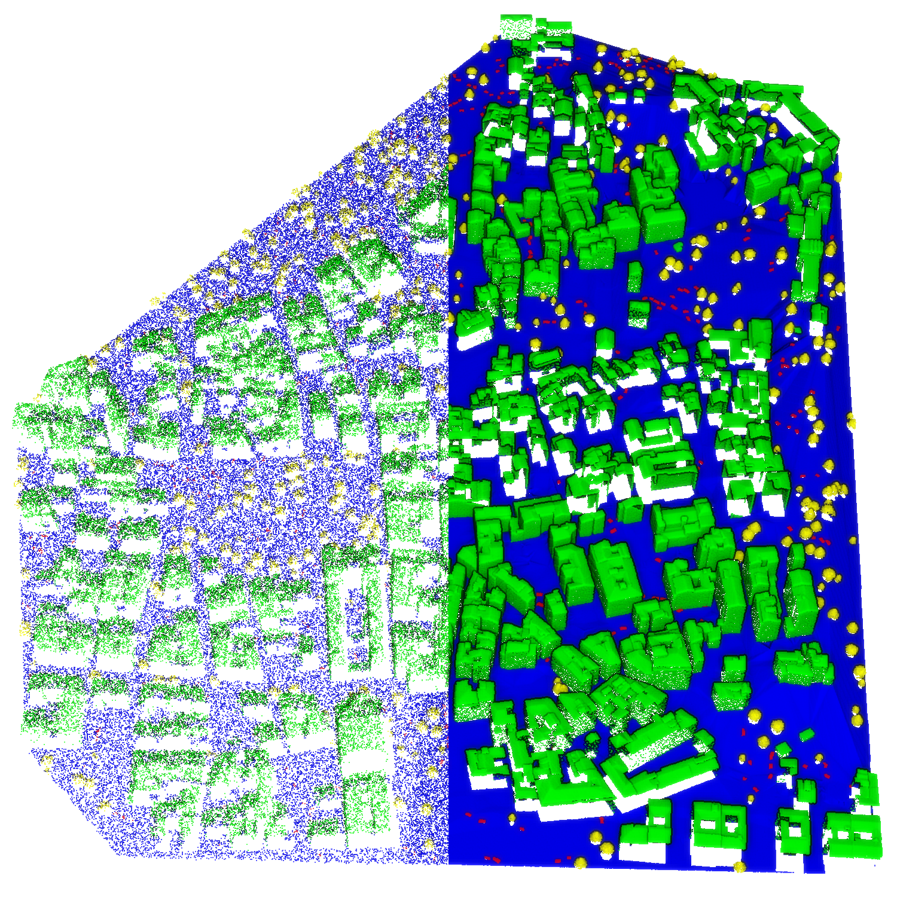

# The Urb3DCD-v2 Dataset



[Original Dataset Website](https://ieee-dataport.org/open-access/urb3dcd-urban-point-clouds-simulated-dataset-3d-change-detection) | [Additional Dataset Details](https://hpicgs.github.io/multi-temporal-point-cloud-datasets-survey/details/Urb3DCD-v2)

## Notes
  - There are multiple point cloud pairs for the three scenes, whereas each point cloud is unique in the buildings recorded, as well as noise, density, and scanning angle. However, the point cloud pairs follow no chronology, i.e., the change labels are only valid within a point cloud pair.

## Scripts
* `compute_statistics.py` computes the minimum, median, and maximum of the number of points and average point neighbor distance across all epochs. It also computes the average percentage of change points per epoch.


The expected folder structure for the data is as follows:

```
Urb3DCD-v2
  |-- 1-Lidar05
        |-- Test
            |-- LyonS
                |-- pointCloud0.ply
                |-- pointCloud1.ply
                |-- ...
            |-- LyonS3
            |-- LyonS4
        |-- Train
        |-- Val
  |-- 5-MultiSensor
```